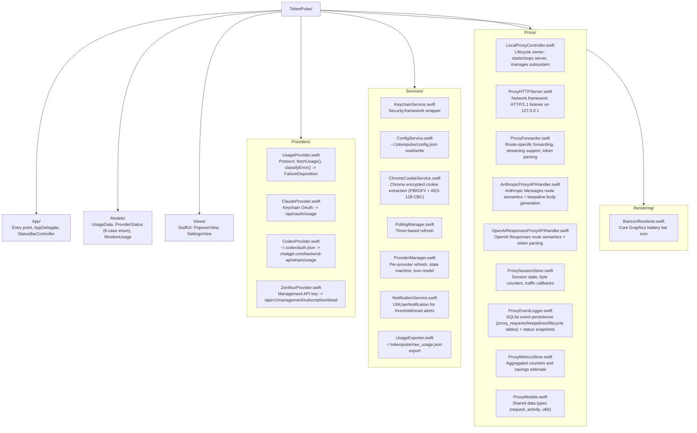

# TokenPulse — Agent Guide

Product description and user-facing docs are in README.md. Provider API specs are in docs/providers.md. This file is for agents working in the codebase.

## Build & run

```bash
open TokenPulse.xcodeproj

# Build
xcodebuild -scheme TokenPulse -configuration Debug build

# Run tests
xcodebuild -scheme TokenPulse -configuration Debug test
```

> For Codex: run the build outside the sandbox so Xcode's plugin and simulator services can initialize normally.

## Git commits

Use conventional commit format: `type: short description` (e.g. `feat: add proxy subsystem`, `fix: correct upstream URL default`). Common types: `feat`, `fix`, `chore`, `refactor`, `docs`, `test`.

## Code style

- Swift strict concurrency checking enabled — resolve all warnings, not just errors
- Prefer async/await over completion handlers
- Use @Observable (Observation framework) for state, not ObservableObject/Combine
- Prefer SwiftUI for all new views; AppKit only where SwiftUI can't (NSStatusItem, NSPopover)
- No force unwraps except in tests
- All user-facing strings must be localized (NSLocalizedString or String(localized:))

## Key constraints

- Never hardcode API keys or credentials — all secrets come from Keychain at runtime
- Minimum 60s polling interval for Claude /api/oauth/usage to avoid 429s
- Always handle provider errors gracefully — dim icon + show stale data rather than crash
- Each provider owns its error classification via `classifyError(_:) -> FailureDisposition`
- ProviderStatus uses 6 cases: unconfigured, pendingFirstLoad, refreshing(lastData:lastMessage:), ready, stale(data:reason:message:), error
- Notifications fire when 5h utilization crosses 50% or 80%, and when quota windows reset (with jitter filtering)
- Run `xcodebuild test` after any model or provider changes
- File I/O (config, usage export) must use `.atomic` writes
- Proxy listens on `127.0.0.1` only (IPv4 loopback) — never bind all interfaces
- Keepalive is manual-only in the current implementation: no background keepalive loops or auto-disable-on-failure policy
- Event log uses SQLite with WAL mode; 24-hour retention with 5-minute prune sweeps
- Status snapshots (`~/.tokenpulse/proxy_status.json`) throttled to 1-second minimum interval

## Architecture quick ref



## Sources of truth

- Product features, install, usage → README.md
- Provider API specs, auth flows, response schemas → docs/providers.md
- Proxy architecture, request flow, keepalive economics, event schema → docs/proxy.md
- Slash animation state machine, timing, rendering → docs/animation.md
- Build commands, code style, constraints → this file
