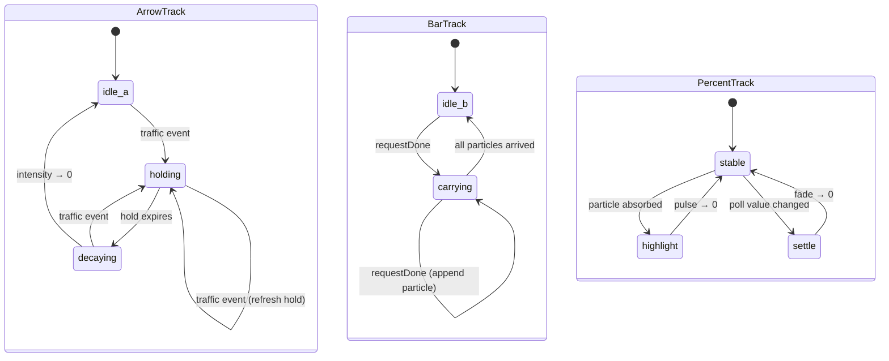

# Composition

The icon is rendered top-to-bottom at 22 pt menu bar height and reads left-to-right:

```
↑  ↓  |  NN%
```

- **↑ upload** and **↓ download** — two custom vector arrows drawn in cyan (`#4FC3F7`) and mint (`#34D399`). Each has an always-visible dim baseline and glows up when its direction records traffic.
- **| bar** — a 1.6 pt wide pill in neutral gray (`#9CA3AF`). It warms to orange (`#FB923C`) and carries a glowing particle across to the digits each time a request completes.
- **NN%** — the active provider's primary-window utilization in monospaced bold (3-char slot; `FUL` at 100% in alert red `#EF4444`).

Arrow vertical alignment is nudged by each arrow's visual center-of-mass offset so both glyphs land on the icon's horizontal centerline even though the head+stem shape is asymmetric about its own midpoint.

# Three independent tracks

Each track advances on every tick of the shared 30 fps timer in `StatusBarController`. The timer runs only while at least one track is non-idle; when all three return to idle it is stopped.



Tracks compose freely: traffic arrows can glow while a particle is mid-flight and a poll value settles, all at the same tick.

## Arrow track (×2, one per direction)

| Field             | Meaning |
|-------------------|---------|
| `intensity`       | 0…1 — drives color saturation and glow radius |
| `holdRemaining`   | Seconds remaining in the hold window |

- A traffic event snaps `intensity` to 1 and resets `holdRemaining` to `arrowHoldDuration` (0.6 s). Repeated events within the hold window refresh the window rather than restart the whole track.
- Once `holdRemaining` reaches 0, `intensity` fades linearly over `arrowDecayDuration` (0.8 s).

## Bar track

| Field      | Meaning |
|------------|---------|
| `particles`| In-flight particles, each with `progress` in 0…1 |
| `carrying` | 0…1 — eases toward 1 while any particle is in flight, back to 0 when the list empties |

- Each `requestDone` event appends a new particle at `progress = 0`. Successful completions only — errored requests don't accrue provider cost and are filtered out in `ProxySessionStore.markRequestDone` before the callback fires.
- On every tick each particle advances by `dt / particleTravelDuration` (0.7 s total). Particles that reach 1.0 are removed and each arrival triggers a `PercentTrack` highlight pulse.
- A soft cap (`particleCap = 5`) prevents runaway spawning during bursts; excess `requestDone` events silently noop until the list has room.
- `carrying` eases at 3.0 s⁻¹ up and 1.5 s⁻¹ down.

## Percent track

| Field        | Meaning |
|--------------|---------|
| `highlight`  | 0…1 — pulse triggered on particle arrival (predicted accrual) |
| `settle`     | 0…1 — fade triggered when a new icon model changes the rounded utilization |

- `highlight` pulses up to 1 whenever a particle arrives and decays over `percentHighlightDuration` (0.7 s). Concurrent arrivals within the decay window coalesce because the state is a single scalar, not a list.
- `settle` pulses up to 1 when `StatusBarController.updateIcon(_:)` receives a `StatusBarIconModel` whose integer-rounded utilization differs from the previous model. It fades over `percentSettleDuration` (1.1 s). The renderer reads this as a subtle brightness dip to signal a crossfade.
- The `alert` flag (utilization ≥ 100) swaps the amber color for the alert red; the digit glyphs switch to `FUL`.

# Event sources

Three callback-driven inputs feed `StatusBarController` from `LocalProxyController` and `ProviderManager`:

| Callback                          | Source                                                              | Drives |
|-----------------------------------|---------------------------------------------------------------------|--------|
| `onTrafficEvent(TrafficDirection?)` | `ProxySessionStore.onTraffic`, with direction set at request start, response-header receipt, and byte-update call sites | Arrow tracks (only when direction is non-nil) |
| `onRequestDone()`                  | `ProxySessionStore.onRequestDone`, fired from `markRequestDone` when `!errored` | Bar track (spawn particle) |
| `onRunningChanged(Bool)`           | `LocalProxyController.isRunning.didSet`                             | Immediate redraw so proxy dim state updates without waiting for traffic |

`ProviderManager.onIconUpdate` calls `StatusBarController.updateIcon(_:)` on provider refreshes, provider switches, and other icon-model updates. That path always redraws the icon and seeds `PercentTrack.settle` when the rounded utilization changes.

# Tunables

All in `StatusBarController`:

| Constant                    | Value  | Effect |
|-----------------------------|--------|--------|
| `fps`                       | 30     | Tick rate for all tracks |
| `arrowHoldDuration`         | 0.60 s | Glow hold window after an upload/download cue event |
| `arrowDecayDuration`        | 0.80 s | Linear fade back to idle |
| `particleTravelDuration`    | 0.70 s | Bar → digits traversal time |
| `particleCap`               | 5      | Max concurrent in-flight particles |
| `barEaseUpPerSec`           | 3.0    | Bar carrying rise rate |
| `barEaseDownPerSec`         | 1.5    | Bar carrying fall rate |
| `percentHighlightDuration`  | 0.70 s | Highlight-pulse decay |
| `percentSettleDuration`     | 1.10 s | Settle-fade decay |

# Rendering

Drawing lives in `BarIconRenderer.renderIcon(_:animation:)`:

- Icon width is computed from a 3-character monospaced digit slot and fixed gap constants, so the menu bar doesn't shuffle as the percentage changes. `FUL` fits the same slot as `99%`.
- Arrow paths are authored in AppKit's unflipped coordinate system (y=0 at the bottom). Each arrow's y-position is offset by `arrowCenterOfMassYOffset` so up and down glyphs align optically.
- Particles render with a short solid trail plus a round dot; the dot uses `cBarC` with a `setShadow` glow.
- The `IconAnimation.proxyEnabled` flag produces a `dim` factor (0.35 when off) that multiplies the *final* alpha of the arrows and bar — not just the animation driver — so the idle state visibly recedes when the proxy is stopped. The percentage is unaffected because it reflects provider polls, not proxy state.

# Key files

- `Rendering/BarIconRenderer.swift` — `IconAnimation`, `renderIcon`, arrow and bar drawing, particle composition
- `App/StatusBarController.swift` — `ArrowTrack` (×2), `BarTrack`, `PercentTrack`, 30 fps tick loop, event ingest
- `Proxy/ProxySessionStore.swift` — emission sites for `onTraffic(.upload|.download|nil)` and `onRequestDone` (gated on successful completion)
- `Proxy/LocalProxyController.swift` — adapter that hops the callbacks onto the main actor
