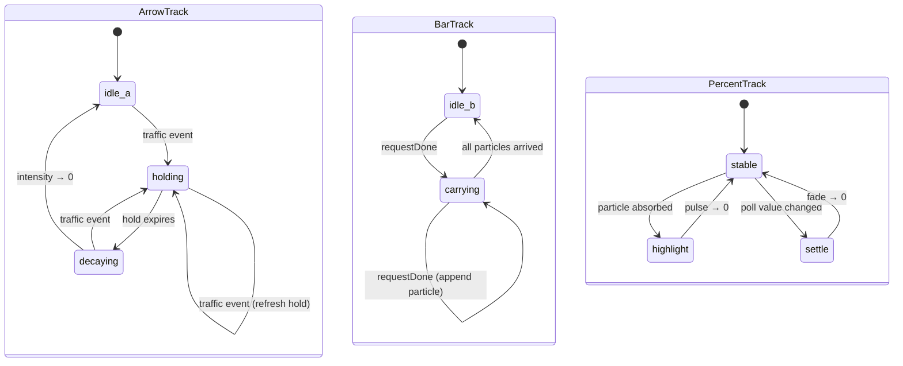

# Composition

The icon is rendered top-to-bottom at 22 pt menu bar height and reads left-to-right:

```
↑  ↓  |  NN%
```

Every part sits at `NSColor.labelColor` when idle — white at 85% alpha on dark menu bars, black at 85% on light menu bars — so the glyph reads like Wi-Fi, Battery, and other stock menu extras between ticks. The palette only blooms during animation, and it swaps between a dark-mode and a light-mode set so the accents stay legible regardless of bar translucency.

- **↑ upload** and **↓ download** — two custom vector arrows that crossfade from labelColor to the palette accent (cyan `#4FC3F7` / blue `#3B82F6` on dark/light; mint `#34D399` / emerald `#10B981`) while `intensity` ramps to 1 and back.
- **| bar** — a 1.6 pt wide pill that sits at labelColor, warming toward amber (`#FBBF24` / `#F59E0B`) while a particle is in flight and returning to labelColor once the list empties.
- **NN%** — monospaced bold utilization in a 3-char slot. Idle it is labelColor; it briefly flashes the palette percent accent (`#F59E0B` / `#D97706`) during `highlight` or `settle` pulses. At `≥100%` the text switches to `FUL`, but it still follows the same pulse-only accent behavior and returns to the idle monochrome template between pulses.

The light-mode accents are intentionally mid-weight (500–600) rather than the deep 700–800 tones the early spec carried. Idle is effectively black on a light menu bar, so a too-dark accent just reads as the same glyph pulsing in place — the crossfade target has to carry enough luminance for the animation to be visible.

Arrow vertical alignment is nudged by each arrow's visual center-of-mass offset so both glyphs land on the icon's horizontal centerline even though the head+stem shape is asymmetric about its own midpoint.

# Three independent tracks

Each track advances on every tick of the shared 30 fps timer in `StatusBarController`. The timer runs only while at least one track is non-idle; when all three return to idle it is stopped.



Tracks compose freely: traffic arrows can glow while a particle is mid-flight and a poll value settles, all at the same tick.

## Arrow track (×2, one per direction)

| Field             | Meaning |
|-------------------|---------|
| `intensity`       | 0…1 — crossfades the fill from labelColor → palette accent and drives glow radius |
| `holdRemaining`   | Seconds remaining in the hold window |

- A traffic event snaps `intensity` to 1 and resets `holdRemaining` to `arrowHoldDuration` (0.6 s). Repeated events within the hold window refresh the window rather than restart the whole track.
- Once `holdRemaining` reaches 0, `intensity` fades linearly over `arrowDecayDuration` (0.8 s). The color follows `intensity`, so the arrow drifts back to labelColor as the glow fades.

## Bar track

| Field      | Meaning |
|------------|---------|
| `particles`| In-flight particles, each with `progress` in 0…1 |
| `carrying` | 0…1 — eases toward 1 while any particle is in flight, back to 0 when the list empties |

- Each `requestDone` event appends a new particle at `progress = 0`. Successful completions only — errored requests don't accrue provider cost and are filtered out in `ProxySessionStore.markRequestDone` before the callback fires.
- On every tick each particle advances by `dt / particleTravelDuration` (0.7 s total). Particles that reach 1.0 are removed and each arrival triggers a `PercentTrack` highlight pulse.
- A soft cap (`particleCap = 5`) prevents runaway spawning during bursts; excess `requestDone` events silently noop until the list has room.
- `carrying` eases at 3.0 s⁻¹ up and 1.5 s⁻¹ down.

## Percent track

| Field        | Meaning |
|--------------|---------|
| `highlight`  | 0…1 — pulse triggered on particle arrival (predicted accrual) |
| `settle`     | 0…1 — fade triggered when a new icon model changes the rounded utilization |

- `highlight` pulses up to 1 whenever a particle arrives and decays over `percentHighlightDuration` (0.7 s). Concurrent arrivals within the decay window coalesce because the state is a single scalar, not a list.
- `settle` pulses up to 1 when `StatusBarController.updateIcon(_:)` receives a `StatusBarIconModel` whose integer-rounded utilization differs from the previous model. Both sides must be non-nil — the initial `nil → value` transition does not pulse, so first-load doesn't flash. It fades over `percentSettleDuration` (1.1 s). The renderer reads this as a subtle brightness dip to signal a crossfade.
- The renderer uses `max(highlight, settle)` as the crossfade parameter for the percent overlay. Between pulses the digits stay on the monochrome template layer; color only appears while a pulse is in flight.
- Utilization `≥100%` still switches the text to `FUL`, but it does not get a separate persistent alert color or steady-state override.

# Event sources

Three callback-driven inputs feed `StatusBarController` from `LocalProxyController` and `ProviderManager`:

| Callback                          | Source                                                              | Drives |
|-----------------------------------|---------------------------------------------------------------------|--------|
| `onTrafficEvent(TrafficDirection?)` | `ProxySessionStore.onTraffic`, with direction set at request start, response-header receipt, and byte-update call sites | Arrow tracks (only when direction is non-nil) |
| `onRequestDone()`                  | `ProxySessionStore.onRequestDone`, fired from `markRequestDone` when `!errored` | Bar track (spawn particle) |
| `onRunningChanged(Bool)`           | `LocalProxyController.isRunning.didSet`                             | Immediate redraw so proxy dim state updates without waiting for traffic |

`ProviderManager.onIconUpdate` calls `StatusBarController.updateIcon(_:)` on provider refreshes, provider switches, and other icon-model updates. That path always redraws the icon and seeds `PercentTrack.settle` when the rounded utilization changes.

# Tunables

All in `StatusBarController`:

| Constant                    | Value  | Effect |
|-----------------------------|--------|--------|
| `fps`                       | 30     | Tick rate for all tracks |
| `arrowHoldDuration`         | 0.60 s | Glow hold window after an upload/download cue event |
| `arrowDecayDuration`        | 0.80 s | Linear fade back to idle |
| `particleTravelDuration`    | 0.70 s | Bar → digits traversal time |
| `particleCap`               | 5      | Max concurrent in-flight particles |
| `barEaseUpPerSec`           | 3.0    | Bar carrying rise rate |
| `barEaseDownPerSec`         | 1.5    | Bar carrying fall rate |
| `percentHighlightDuration`  | 0.70 s | Highlight-pulse decay |
| `percentSettleDuration`     | 1.10 s | Settle-fade decay |

# Rendering

Drawing lives in `BarIconRenderer.renderIcon(_:animation:)`:

- Icon width is computed from a 3-character monospaced digit slot and fixed gap constants, so the menu bar doesn't shuffle as the percentage changes. `FUL` fits the same slot as `99%`.
- Arrow paths are authored in AppKit's unflipped coordinate system (y=0 at the bottom). Each arrow's y-position is offset by `arrowCenterOfMassYOffset` so up and down glyphs align optically.
- Rendering is split into two stacked images: a template base layer that macOS tints to match the real menu bar, and a non-template overlay layer that contains only animated colored deltas.
- Arrow, bar, and digit accents are driven entirely by the overlay layer. Their visible color intensity comes from `intensity`, `carrying`, or `max(highlight, settle)` respectively, which keeps the icon monochrome at rest and colored only while animation is active.
- Particles render with a short solid trail plus a round dot; both use the palette `barCarrying` amber with a `setShadow` glow.
- **Proxy off** (`IconAnimation.proxyEnabled == false`) dims the left half — arrows and bar — via a `dim` factor (0.35) that multiplies each part's final alpha. The digit slot is unaffected because it tracks provider polls, not proxy state.
- **Usage errored / stale / unconfigured / refreshing** dims the right half — the digit slot falls to 55% opacity whenever the provider isn't returning a confident fresh number. Only `.ready` with a utilization value runs at full opacity.

# Key files

- `Rendering/BarIconRenderer.swift` — `IconAnimation`, `renderIcon`, arrow and bar drawing, particle composition
- `App/StatusBarController.swift` — `ArrowTrack` (×2), `BarTrack`, `PercentTrack`, 30 fps tick loop, event ingest
- `Proxy/ProxySessionStore.swift` — emission sites for `onTraffic(.upload|.download|nil)` and `onRequestDone` (gated on successful completion)
- `Proxy/LocalProxyController.swift` — adapter that hops the callbacks onto the main actor
