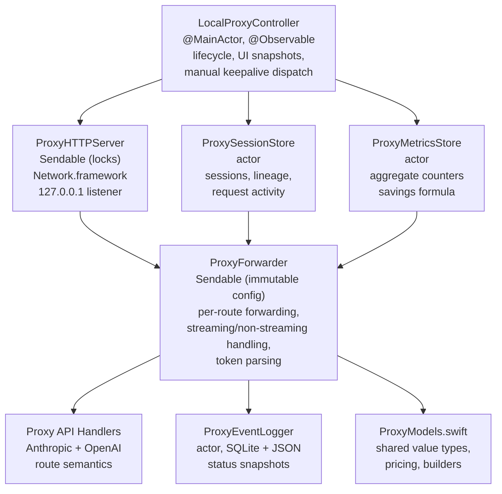
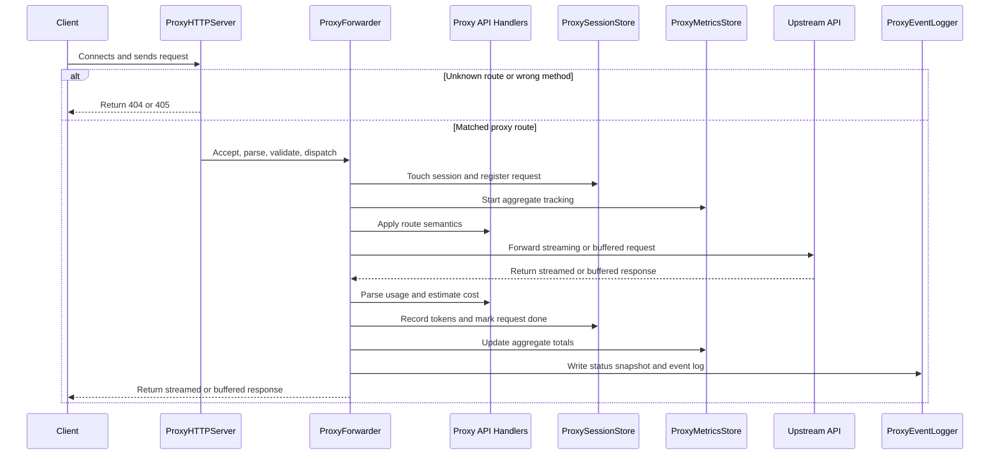

The proxy is an optional local HTTP proxy that sits between AI tools and upstream APIs. It currently serves two route families on the same local port:

- `POST /v1/messages` for Anthropic Messages traffic
- `POST /v1/responses` for OpenAI Responses traffic

Both handlers also accept query-string variants of those paths, such as `/v1/messages?foo=bar` and `/v1/responses?foo=bar`.

It forwards requests transparently while adding two capabilities:

- request observability with per-request token tracking and cost estimation
- manual cache-warming keepalives for tracked Anthropic sessions

# Why it exists

Anthropic prompt caching charges a premium on cache writes but heavily discounts cache reads. When a cached prompt expires, the next request pays the cache-write cost again. TokenPulse keeps enough lineage state to let the user send a minimal manual keepalive request for the main Anthropic session, converting a likely cache miss into a cheap cache read when it matters.

The proxy also provides visibility the upstream APIs do not surface directly in local tools: per-request token usage, per-session aggregation, model selection, byte counts, request timing, and estimated cost.

# Architecture



## Isolation model

| Component | Isolation | Rationale |
|-----------|-----------|-----------|
| `LocalProxyController` | `@MainActor` | Owns `@Observable` state for SwiftUI binding. Reads snapshots and publishes UI state; does not sit on the request hot path. |
| `ProxySessionStore` | `actor` | Owns mutable per-session state: in-flight counts, lineage, token accumulation, done requests, and manual-keepalive metadata. |
| `ProxyMetricsStore` | `actor` | Tracks aggregate counters without contending with the richer session store. |
| `ProxyEventLogger` | `actor` | Owns all SQLite and snapshot file I/O so persistence never blocks forwarding. |
| `ProxyHTTPServer` | `Sendable` (lock-based) | Uses `NSLock`-protected containers for active connections and cancellable tasks. Network.framework callbacks require synchronous state access. |
| `ProxyForwarder` | `Sendable` (immutable) | Holds immutable route config plus `URLSession` instances. All mutable state is passed in as actor references. |
| `AnthropicProxyAPIHandler` / `OpenAIResponsesProxyAPIHandler` | `Sendable` value types | Own route-specific request parsing, session identity, keepalive support, token parsing, and proxy error body shape. |

# Session retention and UI visibility

The proxy keeps session state in memory longer than it keeps every session visible in the popover.

- **Sessions with established Anthropic lineage**: evicted only when they have no in-flight requests and their most recent activity (`max(lastSeenAt, lastKeepaliveAt)`) is older than 24 hours.
- **Sessions without established lineage**: tracked Anthropic sessions use the short-path retention rules until lineage is established. Tracked OpenAI Responses sessions still keep their session summary on the tracked-session retention window even though they do not support lineage/keepalive. `other` traffic always uses the short path.
- **Short-path session eviction**: 60 seconds of inactivity when no requests are in flight.
- **Lineage-tracked UI visibility**: shown when active within the last 10 minutes, or when there are still in-flight requests.
- **Short-path UI visibility**: shown only for the most recent 60 seconds, or while requests are in flight.

Done requests have asymmetric retention:

- **Main-agent-shaped requests in lineage-tracked Anthropic sessions** persist until replaced by a newer superset prompt or until the session expires.
- **Non-main-agent done requests in lineage-tracked sessions** are pruned after 5 minutes.
- **Done requests in short-path sessions** follow the 60-second cutoff.
- **Done requests in tracked OpenAI Responses sessions** follow the 60-second cutoff even though the session row and its cumulative token/cost totals still persist on the tracked-session retention window.

Replacement uses a normalized prompt descriptor built from request-shaping fields:

- `system`
- `tools`
- `tool_choice`
- `thinking`
- ordered `messages`

Normalization intentionally ignores differences that should not break same-lineage matching, including:

- Claude Code billing-header noise in `system`
- presence or absence of `cache_control`
- string-vs-array text block encoding for message content

# Request flow

## High-level flow



```
1. Client connects to 127.0.0.1:<port>
2. ProxyHTTPServer accepts NWConnection on its server queue
3. Server reads incrementally until \r\n\r\n header boundary is found
4. Request line and headers are parsed
5. Content-Length is validated; body is accumulated if present
6. Route validation accepts only:
   - `POST /v1/messages` and query-string variants of that path
   - `POST /v1/responses` and query-string variants of that path
   Known route + wrong method => 405
   Unknown route => 404
7. NWResponseWriter is created and the request is dispatched
8. ProxyForwarder.forward() runs for the matched route
9. Session is touched, request state is registered, metrics/logging begin
10. Upstream request is forwarded via streaming or buffered path
11. Token usage and estimated cost are recorded
12. Request is marked done, status snapshot is written, and keepalive-capable routes may evaluate lineage
13. If Anthropic lineage is established, the session becomes eligible for later manual keepalive
```

## Session identity

- **Anthropic Messages**: session ID comes from `X-Claude-Code-Session-Id`, normalized and stored as `anthropic:<id>`.
- **OpenAI Responses**: traffic is treated as Codex session traffic when all of these are true:
  - `session_id` is present and non-empty
  - `x-codex-window-id` parses as `<session_id>:<window_generation>` where `window_generation` is an integer
  - If `x-codex-parent-thread-id` is absent, the request is stored as `openai:<session_id>`
  - If `x-codex-parent-thread-id` is present, TokenPulse follows parent-thread links already known in the current session store and groups the request under the highest known ancestor; if no parent thread is known yet, it temporarily stores the request as `openai:<session_id>`
- **Everything else**: falls back to `other`.

When a previously unknown Codex root thread later appears, TokenPulse reconciles and merges any temporary child-thread session buckets back into the root session so the activity view heals into the expected single Codex work session.

Tracked sessions store normal request activity and token/cost aggregation. Only Anthropic sessions run lineage tracking and retain keepalive-specific context.

### Empirical basis for Codex detection

The OpenAI Responses detection rule above is based on local observations from 2026-04-14 rather than formal OpenAI API documentation.

- Captured Codex traffic in this environment included the session-related headers `x-codex-window-id`, `session_id`, and, for subagents, `x-codex-parent-thread-id`.
- The observed `x-codex-window-id` format was `{conversation_id}:{window_generation}`.
- The observed `x-codex-parent-thread-id` value pointed at the spawning Codex thread, and nested subagents continued that chain recursively.
- Local Codex source confirms that `session_id` is the conversation/thread identifier and that `x-codex-window-id` reuses that identifier with a `window_generation` suffix.
- Local Codex tests indicate `window_generation` starts at `0`, advances after history compaction, persists on resume, and resets on fork.

These observations are strong enough for conservative session identification, but not strong enough to infer OpenAI cache lifetime or to justify any automatic keepalive policy on the OpenAI route.

## Streaming path

When the request body has `"stream": true`:

1. A per-request `StreamingDelegate` and ephemeral `URLSession` are created.
2. Upload progress updates `ProxyRequestActivity.bytesSent`.
3. When upload finishes, the request transitions to `.waiting`.
4. Response headers arrive through `AsyncStream<Result<HTTPURLResponse, Error>>`.
5. Headers are forwarded to the client with `Transfer-Encoding: chunked`.
6. The request transitions to `.receiving`.
7. Each upstream chunk:
   - updates byte counters
   - is forwarded to the client immediately
   - is accumulated up to 4 MB for terminal token parsing and optional logging
8. The terminal chunk `0\r\n\r\n` is sent after upstream completion.

## Non-streaming path

When `"stream"` is `false` or absent:

1. The shared `nonStreamingSession` is used for connection reuse.
2. A `TaskContext` is registered under `taskIdentifier`.
3. Headers and body are accumulated through the pooled delegate.
4. The full response is returned to the client with `Content-Length`.

# Token usage tracking

Token parsing is route-specific and owned by the matched `ProxyAPIHandler`.

## Anthropic Messages

- **Non-streaming JSON**: parse the top-level `usage` object.
- **Streaming SSE**: parse the final accumulated SSE payload after completion:
  - `message_start.message.usage` contributes input/cache tokens
  - `message_delta.usage` contributes output tokens

## OpenAI Responses

- **Non-streaming JSON**: parse `usage.input_tokens`, `usage.output_tokens`, and `usage.input_tokens_details.cached_tokens`.
- **Streaming SSE**: scan the final accumulated SSE payload for `response.completed` / `response.incomplete` and parse `response.usage`.

## Accumulation

Token usage is recorded at three levels:

1. **Per-request**: `ProxyRequestActivity.tokenUsage` and `.estimatedCost`
2. **Per-session**: `ProxySessionStore.Session` aggregates input/output/cache token totals and estimated cost
3. **Global**: `ProxyMetricsStore` tracks aggregate totals across all sessions

A cumulative cost counter in `ProxySessionStore` survives session expiration until explicitly reset.

# Manual keepalive behavior

Manual keepalive applies only to Anthropic Messages traffic. OpenAI Responses traffic may still be tracked per Codex session, but it does not participate in lineage evaluation or keepalive generation because the upstream cache TTL contract is not documented clearly enough.

## How lineage becomes available

After a successful tracked Anthropic request:

1. `ProxySessionStore.evaluateAndTrackLineage(...)` tries to identify the main agent.
2. During the first two requests, the store looks for the first tools-bearing request and keeps the identification window open until request 2.
3. Once lineage is established, later same-lineage requests update the stored lineage body and headers.
4. If a newer same-lineage request has already received an upstream `2xx` but is still in flight, manual keepalive temporarily prefers that active request body and headers over the last completed lineage snapshot. This is a working hypothesis rather than a documented Anthropic guarantee: TokenPulse treats upstream acceptance as a reasonable signal that the cached prompt state was usable, but not as strict proof of a cache hit.

The session is **not** eligible for keepalive when:

- it is a tracked OpenAI Codex session or `other` traffic
- lineage has not been established yet
- lineage was disabled because no main-agent candidate appeared in the first two requests
- lineage diverged (for example, messages stop being append-only)

## Manual send flow

When the user enables keepalive controls and switches a session to `manual`, `LocalProxyController.sendManualKeepalive(for:)` may issue one keepalive request:

1. Read the freshest keepalive source from `ProxySessionStore`:
   - prefer an in-flight same-lineage Anthropic request that has already received upstream `2xx`, using the hypothesis above
   - otherwise fall back to the last completed tracked lineage body and headers
2. Use `KeepaliveRequestBuilder` to produce the cheapest valid Anthropic replay:
   - `stream = false`
   - `max_tokens = 1`, or `budget_tokens + 1` if thinking mode is enabled
3. Copy saved headers, excluding:
   - `Host`
   - `Content-Length`
   - `Transfer-Encoding`
4. Send a one-shot `POST /v1/messages` with `URLSession.shared`.
5. Parse token usage from the response.
6. Record the result in:
   - `ProxySessionStore`
   - `ProxyMetricsStore`
   - `ProxyEventLogger.proxy_keepalives`

## Failure behavior

Manual keepalive failures are counted and logged, but the current implementation does **not** run an automatic retry loop and does **not** auto-disable after repeated transport failures.

Keepalive disable events are currently used for lineage-based disable reasons, such as:

- `no main-agent candidate in first 2 requests`
- `messages not append-only`

Those disable reasons are shown in the popover and logged to `proxy_lifecycle`.

## Cost economics

Each manual keepalive processes the full Anthropic prompt through the cache but generates minimal output. The code still defines the same high-level economics model:

- **keepalive cost**: about `0.10x` base input rate (cache read)
- **avoided cache miss cost**: about `1.15x` base input rate versus paying another cache write
- **aggregate savings metric**: `max(0, totalCacheReads * 1.15 - totalKeepalivesSent * 0.10)`

`ProxyMetricsStore` still exposes cache read/write counters and the savings formula, but the live forwarding path does not currently update those cache-specific aggregate counters. In the current implementation, forwarded requests record parsed cache token usage in per-request logs and per-session aggregates, while the global `cacheReads` / `cacheWrites` metrics and derived savings value are not actively driven by normal proxy traffic.

# Error handling

## Parser / validator failures

Handled directly by `ProxyHTTPServer`:

- malformed request line => `400`
- invalid header encoding => `400`
- headers too large (> 64 KB) => `400`
- duplicate or invalid `Content-Length` => `400`
- incomplete body => `400`
- known supported path with non-`POST` method => `405`
- unknown route => `404`

These early failures use the server-level proxy error body builder, which currently defaults to Anthropic-style JSON.

## Forwarder failures

Handled inside `ProxyForwarder`:

- invalid upstream URL => `502`
- upstream connection / timeout / no-response / non-HTTP response => `502`
- client disconnect during streaming => upstream task cancelled and logged
- upstream 4xx / 5xx => forwarded to the client as-is

Once a route is known, proxy-generated forwarder errors use that route's handler-specific error body shape:

- Anthropic route => Anthropic-style error JSON
- OpenAI route => OpenAI-style error JSON

# Event logging

## Database

Events are persisted to `~/.tokenpulse/proxy_events.sqlite` using SQLite with WAL mode. Additional pragmas include:

- `foreign_keys = ON`
- `synchronous = NORMAL`

The database is opened lazily on first write. The actor provides serialization, so `SQLITE_OPEN_NOMUTEX` is used.

## Tables

### `proxy_requests`

Stores one row per forwarded API request.

| Column | Type | Description |
|--------|------|-------------|
| `id` | INTEGER PK | Auto-increment row ID |
| `session` | TEXT NOT NULL | Client session ID |
| `model` | TEXT | Model name extracted from request body |
| `method` | TEXT NOT NULL | HTTP method |
| `path` | TEXT NOT NULL | Request path (`/v1/messages` or `/v1/responses`) |
| `upstream_url` | TEXT NOT NULL | Full upstream URL |
| `streaming` | INTEGER NOT NULL | `1` if streaming, `0` otherwise |
| `started_at` | TEXT NOT NULL | ISO 8601 timestamp |
| `completed_at` | TEXT | ISO 8601 timestamp |
| `status_code` | INTEGER | Upstream or proxy HTTP status code |
| `duration_ms` | INTEGER | Wall-clock duration |
| `upstream_request_id` | TEXT | `request-id` / `x-request-id` when available |
| `input_tokens` | INTEGER | Parsed input token count |
| `output_tokens` | INTEGER | Parsed output token count |
| `cache_read_tokens` | INTEGER | Parsed cache-read token count |
| `cache_creation_tokens` | INTEGER | Parsed cache-write token count |
| `error` | TEXT | Proxy-side or upstream error text |
| `errored` | INTEGER | `1` if the request errored |

Indexes: `started_at`, `(session, started_at)`, `(model, started_at)`, `(status_code, started_at)`, `upstream_request_id`.

### `proxy_keepalives`

Stores one row per manual keepalive request.

| Column | Type | Description |
|--------|------|-------------|
| `id` | INTEGER PK | Auto-increment row ID |
| `session` | TEXT NOT NULL | Target session |
| `started_at` | TEXT NOT NULL | ISO 8601 timestamp |
| `completed_at` | TEXT | ISO 8601 timestamp |
| `success` | INTEGER | `1` if successful, `0` if failed |
| `status_code` | INTEGER | Upstream HTTP status code |
| `duration_ms` | INTEGER | Wall-clock duration |
| `upstream_request_id` | TEXT | Upstream request ID header |
| `input_tokens` | INTEGER | Input token count |
| `output_tokens` | INTEGER | Output token count |
| `cache_read_tokens` | INTEGER | Cache-read token count |
| `cache_creation_tokens` | INTEGER | Cache-write token count |
| `error` | TEXT | Error text if failed |

Indexes: `started_at`, `(session, started_at)`.

### `proxy_lifecycle`

Stores lifecycle events:

- `proxy_started`
- `proxy_stopped`
- `session_expired`
- `keepalive_disabled`

| Column | Type | Description |
|--------|------|-------------|
| `id` | INTEGER PK | Auto-increment row ID |
| `ts` | TEXT NOT NULL | ISO 8601 timestamp |
| `type` | TEXT NOT NULL | Event type |
| `session` | TEXT | Session ID when applicable |
| `port` | INTEGER | Listening port for `proxy_started` |
| `reason` | TEXT | Disable reason for `keepalive_disabled` |
| `failure_count` | INTEGER | Currently logged as `0` for lineage-based disable reasons |

### `proxy_request_content`

Optional request/response capture table enabled by `saveProxyPayloads`. Request bodies are stored in full; streaming response bodies are truncated to 4 MB.

| Column | Type | Description |
|--------|------|-------------|
| `request_id` | INTEGER PK | References `proxy_requests(id)` |
| `upstream_request_id` | TEXT | Upstream request ID for cross-reference |
| `request_json` | TEXT | Serialized request (method, path, headers, body) |
| `response_json` | TEXT | Serialized response (status, headers, body) |

Bodies are serialized as UTF-8 when possible, otherwise base64. Streaming captures are truncated at 4 MB and marked as truncated in the serialized payload.

## Retention and pruning

- maximum event age: 24 hours
- prune check interval: at most once every 5 minutes, opportunistically on write
- prune targets:
  - `proxy_requests`
  - `proxy_keepalives`
  - `proxy_lifecycle`
- `proxy_request_content` is cascade-deleted with its parent `proxy_requests` row
- `PRAGMA wal_checkpoint(PASSIVE)` runs after each prune pass

## Insert strategy

Request logging uses a two-phase approach:

1. `logRequestStarted()` inserts the start row and returns its row ID
2. `logRequestCompleted()` or `logRequestFailed()` updates that row

If the initial insert fails, the logger falls back to a standalone insert with the final data.

# Status snapshots

When `ProxyEventLogger` is enabled, the proxy writes an atomic JSON snapshot to `~/.tokenpulse/proxy_status.json` after forwarded proxy request completions and during forced proxy shutdown. Manual keepalive completions do not trigger snapshot writes. The writes are throttled, so multiple completions inside the throttle window may collapse into one later snapshot.

## Format

```json
{
  "enabled": true,
  "port": 8080,
  "activeSessions": 2,
  "activeKeepalives": 0,
  "totalRequestsForwarded": 47,
  "totalKeepalivesSent": 12,
  "totalKeepalivesFailed": 1,
  "cacheReads": 10,
  "cacheWrites": 3,
  "totalInputTokens": 245000,
  "totalOutputTokens": 18200,
  "totalCacheReadInputTokens": 180000,
  "totalCacheCreationInputTokens": 12000,
  "lastUpdatedAt": "2026-04-13T10:30:00Z"
}
```

`activeKeepalives` is still present in the schema but is currently written as `0`; the implementation no longer tracks background keepalive loops.

## Throttling

Writes are throttled to a minimum 1-second interval. When a new snapshot arrives inside that window:

1. it becomes `pendingStatusSnapshot`
2. a delayed flush task is scheduled
3. only the latest pending snapshot is written when the task fires

Forced writes, used during proxy shutdown, bypass the throttle and cancel any pending flush.

# Configuration

Proxy settings live in `~/.tokenpulse/config.json` and are managed by `ConfigService`.

| Field | Type | Default | Description |
|-------|------|---------|-------------|
| `proxyEnabled` | Bool | `false` | Whether the proxy starts automatically with the app |
| `proxyPort` | Int | `8080` | TCP port to bind on `127.0.0.1` |
| `anthropicUpstreamURL` | String | `"https://zenmux.ai/api/anthropic"` | Base URL for Anthropic Messages forwarding |
| `openAIUpstreamURL` | String | `"https://api.openai.com"` | Base URL for OpenAI Responses forwarding |
| `keepaliveEnabled` | Bool | `false` | Shows per-session manual keepalive controls in the popover for Anthropic Messages traffic |
| `keepaliveIntervalSeconds` | Int | `240` | Persisted compatibility field; currently unused by the manual keepalive flow |
| `proxyInactivityTimeoutSeconds` | Int | `900` | Persisted compatibility field; currently unused by the manual keepalive flow |
| `saveProxyEventLog` | Bool | `true` | Whether to persist proxy metadata to SQLite |
| `saveProxyPayloads` | Bool | `false` | Whether to capture full request/response payloads in `proxy_request_content` |

Legacy `proxyUpstreamURL` is still read during config migration and mapped to `anthropicUpstreamURL`.

# Constraints

| Constraint | Value | Enforced by |
|------------|-------|-------------|
| Bind address | `127.0.0.1` (IPv4 loopback only) | `ProxyHTTPServer` |
| Supported endpoints | `POST /v1/messages` and `POST /v1/responses`, plus query-string variants of those paths | `LocalProxyController.requestValidator` |
| Max Content-Length | 50 MB (`50_000_000`) | `ProxyHTTPServer.processRequest()` |
| Max header size | 64 KB (`65_536`) | `ProxyHTTPServer.readRequest()` |
| Tracked session retention | 24 hours since last activity for Anthropic and detected Codex/OpenAI sessions | `LocalProxyController.sessionRetentionSeconds` |
| `other` session retention | 60 seconds since last activity | `LocalProxyController.otherTrafficRetentionSeconds` |
| Tracked session UI visibility | 10 minutes since last activity, or any in-flight request | `LocalProxyController.visibleSessionActivities(...)` |
| Non-main-agent done request retention | 5 minutes | `LocalProxyController.sideTrafficDoneRetentionSeconds` + `ProxySessionStore.pruneStaleDoneRequests(...)` |
| Event retention | 24 hours | `ProxyEventLogger.maxEventAge` |
| Event prune pass | Opportunistic on write after 5 minutes have elapsed since the last prune | `ProxyEventLogger.pruneInterval` |
| Status snapshot throttle | 1 second minimum interval | `ProxyEventLogger.statusSnapshotThrottleInterval` |
| Streaming capture for parsing/logging | 4 MB max | `ProxyForwarder.maxLoggedStreamingResponseBytes` |
| Forwarding timeouts | 300s request / 600s resource | `ProxyForwarder` URLSession configuration |

# Key files

| File | Role |
|------|------|
| `Proxy/LocalProxyController.swift` | `@MainActor` lifecycle owner; starts/stops server; publishes UI state; dispatches manual keepalives |
| `Proxy/ProxyHTTPServer.swift` | Network.framework HTTP/1.1 listener; parser; validator; `NWResponseWriter` implementation |
| `Proxy/ProxyForwarder.swift` | Route-specific forwarding, streaming/non-streaming handling, token parsing, request completion bookkeeping |
| `Proxy/AnthropicProxyAPIHandler.swift` | Anthropic Messages route semantics, session identity, lineage support, keepalive body generation, Anthropic error bodies |
| `Proxy/OpenAIResponsesProxyAPIHandler.swift` | OpenAI Responses route semantics, strict Codex session detection, token parsing, OpenAI error bodies |
| `Proxy/ProxySessionStore.swift` | Actor; session lifecycle, lineage evaluation, request state machine, token accumulation, keepalive stats |
| `Proxy/ProxyEventLogger.swift` | Actor; SQLite event persistence, optional content capture, status snapshots with throttling |
| `Proxy/ProxyMetricsStore.swift` | Actor; aggregate counters and savings formula |
| `Proxy/ProxyModels.swift` | Shared value types and helpers: `ProxyAPIFlavor`, `ProxySessionID`, `KeepaliveMode`, `KeepaliveRequestBuilder`, `TokenUsage`, `ModelPricingTable`, `ProxyHTTPUtils` |
