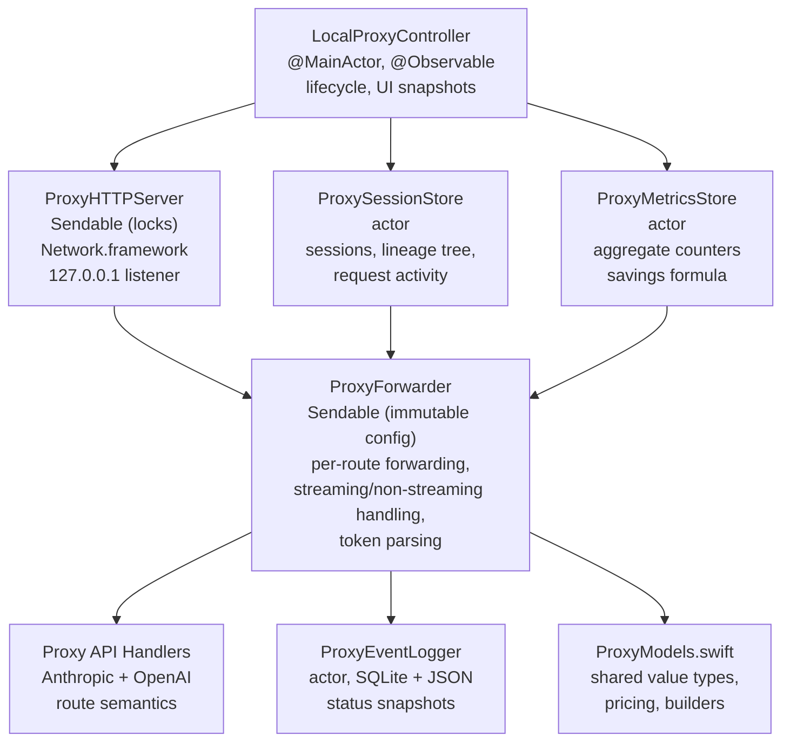
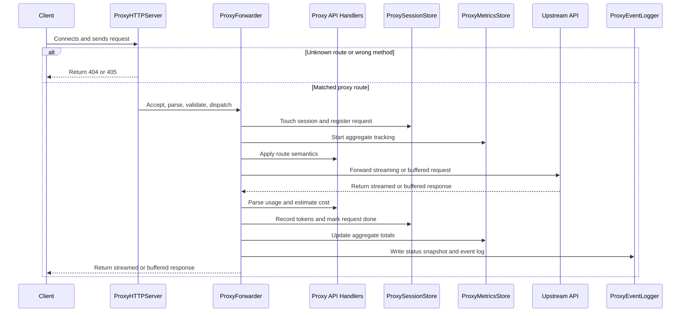

The proxy is an optional local HTTP proxy that sits between AI tools and upstream APIs. It currently serves two route families on the same local port:

- `POST /v1/messages` for Anthropic Messages traffic
- `POST /v1/responses` for OpenAI Responses traffic

Both handlers also accept query-string variants of those paths, such as `/v1/messages?foo=bar` and `/v1/responses?foo=bar`.

It forwards requests transparently while adding two capabilities:

- request observability with per-request token tracking and cost estimation
- a universal content tree over proxied requests, used for popup UI display and payload deduplication in the event log

# Why it exists

The proxy provides visibility that upstream APIs do not surface directly in local tools: per-request token usage, per-session aggregation, model selection, byte counts, request timing, and estimated cost. It also assembles proxied requests into a **content tree** — a conversation-level structure where each tree node is a content checkpoint (a point in the conversation's message-prefix space) and each attached request is an attempt at that checkpoint. Nodes dedupe shared conversation prefixes across requests, so the event logger stores message content once per node instead of once per request.

Keep-alive (cache-warming replay requests) is **not currently implemented**; the previous Claude-Code-specific manual keep-alive button and its supporting state were removed in favor of the universal tree. Keep-alive may return in a future iteration built on top of the tree.

# Architecture



## Isolation model

| Component | Isolation | Rationale |
|-----------|-----------|-----------|
| `LocalProxyController` | `@MainActor` | Owns `@Observable` state for SwiftUI binding. Reads snapshots and publishes UI state; does not sit on the request hot path. |
| `ProxySessionStore` | `actor` | Owns mutable per-session state: in-flight counts, the in-memory `ContentTree`, token accumulation, and done requests. |
| `ProxyMetricsStore` | `actor` | Tracks aggregate counters without contending with the richer session store. |
| `ProxyEventLogger` | `actor` | Owns all SQLite and snapshot file I/O so persistence never blocks forwarding. |
| `ProxyHTTPServer` | `Sendable` (lock-based) | Uses `NSLock`-protected containers for active connections and cancellable tasks. Network.framework callbacks require synchronous state access. |
| `ProxyForwarder` | `Sendable` (immutable) | Holds immutable route config plus `URLSession` instances. All mutable state is passed in as actor references. |
| `AnthropicProxyAPIHandler` / `OpenAIResponsesProxyAPIHandler` | `Sendable` value types | Own route-specific request parsing, session identity, lineage fingerprint / message normalization / response-ID extraction, token parsing, and proxy error body shape. |

# Content tree

Every proxied request whose body carries a messages-style stack (Anthropic Messages `messages`, OpenAI Responses `input`) — or an OpenAI `previous_response_id` pointer to a previously-seen response — is attached to an in-memory `ContentTree` the moment its body has been fully parsed, before upstream is contacted.

## Model

Tree granularity is **content**, not requests:

- A **conversation** is a single tree rooted at a synthetic empty-messages node and keyed by `(flavor, fingerprint_hash)`. The fingerprint is a stable hash of the cache-identity fields: `model`, `system`/`instructions`, `tools`, `tool_choice`, `thinking`/`reasoning`.
- A **node** is a content checkpoint — a point in the conversation's message-prefix space. Each non-root node stores only its **delta messages** (the messages it appends to its parent's cumulative prefix) and its `cumulative_hash` (the fold-hash of the full prefix at that node). Deltas are immutable after creation.
- A **request** is one attempt attached to a node. It carries `session_id`, `previous_response_id`, `response_id`, `created_at`, `finished_at`, `succeeded`, and `token_usage`. States match the existing request pipeline: `uploading` → `waiting` → `receiving` → terminal (`succeeded` / errored / cancelled). A node may own **multiple** requests; we do not restrict to one.

## Invariants

- Root nodes always have an empty `deltaMessages` list and exist for every conversation.
- Nodes are never re-parented. Deltas are write-once. New requests either attach to an existing node (the prefix already exists) or create a new child node carrying the trimmed-off suffix.
- `done`/`active` are attributes of **requests**, not nodes. A request is *displayable* when it has `succeeded == true` and its node has no descendant node with any succeeded request.
- When an incoming request's prefix lands *inside* an existing node's multi-message delta (rather than on a node boundary), the matcher treats it as a fresh conversation-prefix and creates a new branch. This is a rare case we accept rather than splitting existing deltas.
- Errored / cancelled / mid-stream-terminated requests stay in the tree with `succeeded == false` and age out via request pruning.

## Matching

Attach is O(N) in the request's message count:

1. Compute prefix hashes `H_0..H_N` in one pass, folding each message's per-message `contentHash` into a running SHA-256 (`H_k = SHA256(H_{k-1} + ":" + contentHash_k)`). Each message is hashed exactly once.
2. For `k` from `N` down to `0`, look up the conversation's `nodesByHash[H_k]`. The root's `H_0` is always registered, so the loop terminates.
3. If `k == N`, attach the request to the matched node (no new content).
4. Otherwise, create a new child node whose `parentNodeID` is the match and whose `deltaMessages` is the suffix `messages[k..<N]`, and record the request on it.

For OpenAI `previous_response_id` bodies with no messages, the tree force-links to the node whose request produced that response (via the `responseID → nodeID` index). Unknown `previous_response_id` falls through to the root node.

## Pruning

- **Requests** prune 24 hours after `finishedAt`. In-flight requests (`finishedAt == nil`) never age out on their own — they finalize via the pipeline.
- **Nodes** prune once they have no requests *and* no descendant nodes. Root nodes drop only when the conversation is being evicted.
- **Conversations** evict once their root has no requests, no descendants, and no activity within the retention window.
- Pruning is destructive in both memory and SQLite. A descendant that later reappears after its ancestor was pruned becomes a new root.

## Session retention and UI visibility

Sessions are a thin UI grouping layer; they do not drive tree matching.

- Sessions with a recognized flavor (Anthropic / OpenAI) keep their session summary for up to 24 hours; `other` traffic expires after 5 minutes of inactivity when no requests are in flight.
- Session tracking and logging continue to use the underlying `ProxySessionStore`; the UI applies its own visibility filter on top of those tracked sessions for popup display.
- Active (in-flight) requests are always shown.
- Done requests in flavored sessions come from `ContentTree.displayableRequests()` — a successful request is displayable until its node has any descendant carrying a succeeded request. If a descendant has only in-flight requests, the parent's row is still displayed but **dimmed** pending completion. In untracked (`other`) sessions, done requests follow the same 5-minute cutoff.
- Identified sessions remain visible in the popup while any request is in flight, or until 10 minutes have passed since the most recent completed request.
- Errored / cancelled requests disappear from the "active" section on termination and do not become displayable; they remain in the tree as auditable records until they age out.

## Message normalization

Normalization is provider-specific and intentionally least-destructive. It only collapses differences that the provider treats as generation-equivalent:

- Anthropic: Claude Code billing-header noise in `system`
- Anthropic: presence or absence of `cache_control`
- Anthropic: string-vs-array text block encoding for message content
- Anthropic: consecutive same-role messages, which the API coalesces server-side
- OpenAI: top-level string `input` promoted to an explicit `{"role":"user","content":...}` message
- OpenAI: message `content` string promoted to typed text input blocks (`{"type":"input_text","text":...}`)

OpenAI non-message `input` items are preserved in order and normalized recursively; they are not dropped during lineage matching.

Each normalized message is hashed (SHA-256 over canonical JSON) to drive prefix comparison efficiently.

# Request flow

## High-level flow



```
1. Client connects to 127.0.0.1:<port>
2. ProxyHTTPServer accepts NWConnection on its server queue
3. Server reads incrementally until \r\n\r\n header boundary is found
4. Request line and headers are parsed
5. Content-Length is validated; body is accumulated if present
6. Route validation accepts only:
   - `POST /v1/messages` and query-string variants of that path
   - `POST /v1/responses` and query-string variants of that path
   Known route + wrong method => 405
   Unknown route => 404
7. NWResponseWriter is created and the request is dispatched
8. ProxyForwarder.forward() runs for the matched route
9. Session is touched, request state is registered, metrics/logging begin
10. The request body is parsed and the request is attached to the content tree (conversation + node); the request enters its in-flight state
11. Upstream request is forwarded via streaming or buffered path
12. Token usage and estimated cost are recorded
13. On terminal state the tree request is finalized with `succeeded: true/false` and the tree mirror rows are written to SQLite alongside the request row
```

## Session identity

Session identity is a **UI grouping key**, not a tree key. A conversation in the content tree can span multiple session IDs (e.g. Codex subagents) and vice versa; the tree treats them as one conversation whenever their fingerprints and messages align.

- **Anthropic Messages**: session ID comes from `X-Claude-Code-Session-Id`, normalized and stored as `anthropic:<id>`.
- **OpenAI Responses**: treated as Codex session traffic when `session_id` is present and matches the `x-codex-window-id` prefix (`<session_id>:<window_generation>`). Otherwise it falls into `other`. Thread reconciliation across parent/child Codex threads is no longer required — the content tree collapses child-thread traffic into the right conversation via `previous_response_id` linkage.
- **Everything else**: falls back to `other`.

Tracked sessions store normal request activity and token/cost aggregation.

### Empirical basis for Codex detection

The OpenAI Responses detection rule above is based on local observations from 2026-04-14 rather than formal OpenAI API documentation.

- Captured Codex traffic in this environment included the session-related headers `x-codex-window-id`, `session_id`, and, for subagents, `x-codex-parent-thread-id`.
- The observed `x-codex-window-id` format was `{conversation_id}:{window_generation}`.
- The observed `x-codex-parent-thread-id` value pointed at the spawning Codex thread, and nested subagents continued that chain recursively.
- Local Codex source confirms that `session_id` is the conversation/thread identifier and that `x-codex-window-id` reuses that identifier with a `window_generation` suffix.
- Local Codex tests indicate `window_generation` starts at `0`, advances after history compaction, persists on resume, and resets on fork.

These observations are strong enough for conservative session identification. The lineage tree links child-thread traffic via `previous_response_id` when available.

## Streaming path

When the request body has `"stream": true`:

1. A per-request `StreamingDelegate` and ephemeral `URLSession` are created.
2. Upload progress updates `ProxyRequestActivity.bytesSent`.
3. When upload finishes, the request transitions to `.waiting`.
4. Response headers arrive through `AsyncStream<Result<HTTPURLResponse, Error>>`.
5. Headers are forwarded to the client with `Transfer-Encoding: chunked`.
6. The request transitions to `.receiving`.
7. Each upstream chunk:
   - updates byte counters
   - is forwarded to the client immediately
   - is accumulated up to 4 MB for terminal token parsing and optional logging
8. The terminal chunk `0\r\n\r\n` is sent after upstream completion.

## Non-streaming path

When `"stream"` is `false` or absent:

1. The shared `nonStreamingSession` is used for connection reuse.
2. A `TaskContext` is registered under `taskIdentifier`.
3. Headers and body are accumulated through the pooled delegate.
4. The full response is returned to the client with `Content-Length`.

# Token usage tracking

Token parsing is route-specific and owned by the matched `ProxyAPIHandler`.

## Anthropic Messages

- **Non-streaming JSON**: parse the top-level `usage` object.
- **Streaming SSE**: parse the final accumulated SSE payload after completion:
  - `message_start.message.usage` contributes input/cache tokens
  - `message_delta.usage` contributes output tokens

## OpenAI Responses

- **Non-streaming JSON**: parse `usage.input_tokens`, `usage.output_tokens`, and `usage.input_tokens_details.cached_tokens`.
- **Streaming SSE**: scan the final accumulated SSE payload for `response.completed` / `response.incomplete` and parse `response.usage`.

## Accumulation

Token usage is recorded at three levels:

1. **Per-request**: `ProxyRequestActivity.tokenUsage` and `.estimatedCost`
2. **Per-session**: `ProxySessionStore.Session` aggregates input/output/cache token totals and estimated cost
3. **Global**: `ProxyMetricsStore` tracks aggregate totals across all sessions

A cumulative cost counter in `ProxySessionStore` survives session expiration until explicitly reset.

# Keep-alive

Keep-alive (cache-warming replay requests) is **not currently implemented**. The universal content tree replaces the previous Claude-Code-specific manual keep-alive surface. A future iteration may use the tree's accepted-request nodes to synthesize replay requests across supported providers.

# Error handling

## Parser / validator failures

Handled directly by `ProxyHTTPServer`:

- malformed request line => `400`
- invalid header encoding => `400`
- headers too large (> 64 KB) => `400`
- duplicate or invalid `Content-Length` => `400`
- incomplete body => `400`
- known supported path with non-`POST` method => `405`
- unknown route => `404`

These early failures use the server-level proxy error body builder, which currently defaults to Anthropic-style JSON.

## Forwarder failures

Handled inside `ProxyForwarder`:

- invalid upstream URL => `502`
- upstream connection / timeout / no-response / non-HTTP response => `502`
- client disconnect during streaming => upstream task cancelled and logged
- upstream 4xx / 5xx => forwarded to the client as-is

Once a route is known, proxy-generated forwarder errors use that route's handler-specific error body shape:

- Anthropic route => Anthropic-style error JSON
- OpenAI route => OpenAI-style error JSON

# Event logging

## Database

Events are persisted to `~/.tokenpulse/proxy_events.sqlite` using SQLite with:

- `foreign_keys = ON`
- `journal_mode = WAL`
- `synchronous = NORMAL`

The database is opened lazily on first write when `ProxyEventLogger` is enabled (i.e. `saveProxyEventLog == true`). That single toggle controls metadata, lineage-deduplicated payload storage, the bounded raw source-of-truth table, and status snapshots; there is no separate payload-capture opt-in. A `proxy_schema` table stores the current schema version; on mismatch the whole database is dropped and rebuilt (24h retention means no meaningful loss). The actor provides serialization, so `SQLITE_OPEN_NOMUTEX` is used.

## Tables

### `proxy_conversations`

One row per conversation (cache-identity bucket).

| Column | Type | Description |
|--------|------|-------------|
| `id` | TEXT PK | Conversation UUID |
| `flavor` | TEXT NOT NULL | `anthropicMessages` \| `openAIResponses` |
| `fingerprint_hash` | TEXT NOT NULL | SHA-256 of normalized identity (`model` + `system`/`instructions` + `tools` + `tool_choice` + `thinking`/`reasoning`) |
| `fingerprint_json` | TEXT NOT NULL | Serialized `LineageFingerprint` for replay / diagnostics |
| `root_node_id` | TEXT NOT NULL | UUID of the conversation's synthetic empty-messages root node |
| `first_seen` / `last_seen` | TEXT | ISO 8601 timestamps |

### `proxy_nodes`

Content checkpoints. Each non-root row stores only the **delta messages** its creating request appended to its parent's cumulative prefix — writes are O(delta) per request regardless of conversation depth. Rows are immutable after creation; only `last_activity` is ever updated.

| Column | Type | Description |
|--------|------|-------------|
| `id` | TEXT PK | Node UUID |
| `conversation_id` | TEXT NOT NULL | FK → `proxy_conversations(id)` `ON DELETE CASCADE` |
| `parent_node_id` | TEXT | FK → `proxy_nodes(id)` `ON DELETE CASCADE`; nil for the conversation root |
| `delta_messages_json` | TEXT NOT NULL | JSON array of normalized messages this node adds to its parent's prefix (`[]` for the root) |
| `last_activity` | TEXT NOT NULL | ISO 8601 timestamp, refreshed on every request that lands on this node |

### `proxy_requests`

One row per forwarded API request. Rows carry both the request metadata and the content-tree coordinates of the node they attached to.

| Column | Type | Description |
|--------|------|-------------|
| `id` | INTEGER PK | Auto-increment row ID |
| `session` | TEXT NOT NULL | Client session ID |
| `model` | TEXT | Model name extracted from request body |
| `method` | TEXT NOT NULL | HTTP method |
| `path` | TEXT NOT NULL | Request path |
| `upstream_url` | TEXT NOT NULL | Full upstream URL |
| `streaming` | INTEGER NOT NULL | `1` if streaming, `0` otherwise |
| `started_at` / `completed_at` | TEXT | ISO 8601 timestamps |
| `status_code` | INTEGER | Upstream or proxy HTTP status code |
| `duration_ms` | INTEGER | Wall-clock duration |
| `upstream_request_id` | TEXT | `request-id` / `x-request-id` when available |
| `input_tokens` / `output_tokens` / `cache_read_tokens` / `cache_creation_tokens` | INTEGER | Parsed token counts |
| `error` | TEXT | Proxy-side or upstream error text |
| `errored` | INTEGER | `1` if the request errored |
| `conversation_id` | TEXT | FK → `proxy_conversations(id)` `ON DELETE SET NULL` |
| `node_id` | TEXT | FK → `proxy_nodes(id)` `ON DELETE SET NULL` |
| `response_id` | TEXT | Upstream `msg_*` / `resp_*` identifier when known |
| `previous_response_id` | TEXT | OpenAI `previous_response_id` when used |
| `done` | INTEGER NOT NULL | `1` when the request completed successfully |

Indexes: `started_at`, `(session, started_at)`, `(model, started_at)`, `(status_code, started_at)`, `upstream_request_id`, `conversation_id`, `node_id`, `response_id`.

### `proxy_lifecycle`

Stores lifecycle events: `proxy_started`, `proxy_stopped`, `session_expired`.

| Column | Type | Description |
|--------|------|-------------|
| `id` | INTEGER PK | Auto-increment row ID |
| `ts` | TEXT NOT NULL | ISO 8601 timestamp |
| `type` | TEXT NOT NULL | Event type |
| `session` | TEXT | Session ID when applicable |
| `port` | INTEGER | Listening port for `proxy_started` |
| `reason` | TEXT | Free-form reason (reserved) |
| `failure_count` | INTEGER | Reserved |

### `proxy_request_content`

Stores request/response captures. When the request has content-tree coordinates, the cache-identity fields (`model`, `system`/`instructions`, `tools`, `tool_choice`, `thinking`/`reasoning`), the messages stack (`messages` for Anthropic, `input` for OpenAI Responses), and `previous_response_id` are stripped from the stored body and replaced with refs back to the conversation and node:

```json
{
  "body_extras": { "max_tokens": 1024, "stream": true, "temperature": 0.2, "...": "..." },
  "body_refs":   {
    "fingerprint": "<conversation-uuid>",
    "content":     { "node_id": "<node-uuid>" }
  }
}
```

The fingerprint fields live on `proxy_conversations.fingerprint_json`; the messages array is reconstructed by walking `proxy_nodes.parent_node_id` from the node up to the root and concatenating each node's `delta_messages_json`. Request bodies without content-tree coordinates are stored in full otherwise. Streaming response bodies in this deduplicated table keep the first 4 MB captured for parsing/logging.

| Column | Type | Description |
|--------|------|-------------|
| `request_id` | INTEGER PK | References `proxy_requests(id)` |
| `upstream_request_id` | TEXT | Upstream request ID for cross-reference |
| `request_extras_json` | TEXT | Serialized request (method, path, headers, body — body may be the `body_extras` / `body_refs` shape above) |
| `response_json` | TEXT | Serialized response (status, headers, body) |

Bodies are serialized as UTF-8 when possible, otherwise base64. Bodies whose fingerprint and messages have been substituted with refs are marked with `"encoding": "utf8-refs"`.

### `proxy_raw_request_response`

Stores a bounded source-of-truth copy of the exact proxied exchange without lineage stripping. Each row is keyed by `request_id` and captures the raw request and the exact response bytes observed by the proxy: method, path (including query string), upstream URL, headers, and body bytes. Bodies are serialized as UTF-8 when possible, otherwise base64. For streaming failures after upstream bytes have already arrived, this table preserves the observed partial upstream response instead of replacing it with a synthetic proxy `502` body.

| Column | Type | Description |
|--------|------|-------------|
| `request_id` | INTEGER PK | References `proxy_requests(id)` |
| `captured_at` | TEXT NOT NULL | ISO 8601 timestamp when the raw exchange was written |
| `request_json` | TEXT | Serialized raw request capture |
| `response_json` | TEXT | Serialized raw response capture |

## Retention and pruning

- maximum event age: 24 hours
- prune check interval: at most once every 5 minutes, opportunistically on writes
- SQLite prune targets: `proxy_requests`, `proxy_lifecycle`
- `proxy_request_content` is cascade-deleted with its parent `proxy_requests` row
- `proxy_raw_request_response` is cascade-deleted with its parent `proxy_requests` row and independently capped to the newest 1000 rows
- `proxy_nodes` and `proxy_conversations` rows are removed via `ProxyEventLogger.pruneLineageMirror(...)` after the in-memory `ContentTree.prune(...)` drops them, so both sides stay in sync
- `PRAGMA wal_checkpoint(PASSIVE)` runs after each prune pass

## Insert strategy

Request logging uses a two-phase approach:

1. `logRequestStarted()` inserts the start row and returns its row ID
2. `logRequestCompleted()` or `logRequestFailed()` updates that row

If the initial insert fails, the logger falls back to a standalone insert with the final data.

# Status snapshots

When `ProxyEventLogger` is enabled (`saveProxyEventLog == true`), the proxy writes an atomic JSON snapshot to `~/.tokenpulse/proxy_status.json` after forwarded proxy request completions and during forced proxy shutdown. `activeSessions` is the raw tracked session count from `sessionStore.activeSessions()`, not the popup's UI-filtered visible-session count. The writes are throttled, so multiple completions inside the throttle window may collapse into one later snapshot.

## Format

```json
{
  "enabled": true,
  "port": 8080,
  "activeSessions": 2,
  "totalRequestsForwarded": 47,
  "totalInputTokens": 245000,
  "totalOutputTokens": 18200,
  "totalCacheReadInputTokens": 180000,
  "totalCacheCreationInputTokens": 12000,
  "lastUpdatedAt": "2026-04-13T10:30:00Z"
}
```

The keep-alive fields (`activeKeepalives`, `totalKeepalivesSent`, `totalKeepalivesFailed`) and the per-snapshot cache summary counters (`cacheReads`, `cacheWrites`) were removed along with the keep-alive surface; per-request cache token counts still land on `proxy_requests` and on per-session totals.

## Throttling

Writes are throttled to a minimum 1-second interval. When a new snapshot arrives inside that window:

1. it becomes `pendingStatusSnapshot`
2. a delayed flush task is scheduled
3. only the latest pending snapshot is written when the task fires

Forced writes, used during proxy shutdown, bypass the throttle and cancel any pending flush.

# Configuration

Proxy settings live in `~/.tokenpulse/config.json` and are managed by `ConfigService`.

| Field | Type | Default | Description |
|-------|------|---------|-------------|
| `proxyEnabled` | Bool | `false` | Whether the proxy starts automatically with the app |
| `proxyPort` | Int | `8080` | TCP port to bind on `127.0.0.1` |
| `anthropicUpstreamURL` | String | `"https://zenmux.ai/api/anthropic"` | Base URL for Anthropic Messages forwarding |
| `openAIUpstreamURL` | String | `"https://api.openai.com"` | Base URL for OpenAI Responses forwarding |
| `saveProxyEventLog` | Bool | `true` | Master on/off for `ProxyEventLogger`. When enabled, the logger persists SQLite metadata, lineage-deduplicated request/response payloads, bounded raw exact request/response captures, and status snapshots. When disabled, no SQLite database is opened and no status snapshot is written. |

The legacy `keepaliveEnabled`, `keepaliveIntervalSeconds`, `proxyInactivityTimeoutSeconds`, and `saveProxyPayloads` fields are still tolerated by the config migration (they were fields in version 6) but are no longer written or read by the live code. The current config schema version is `7`.

Legacy `proxyUpstreamURL` is still read during config migration and mapped to `anthropicUpstreamURL`.

# Constraints

| Constraint | Value | Enforced by |
|------------|-------|-------------|
| Bind address | `127.0.0.1` (IPv4 loopback only) | `ProxyHTTPServer` |
| Supported endpoints | `POST /v1/messages` and `POST /v1/responses`, plus query-string variants of those paths | `LocalProxyController.requestValidator` |
| Max Content-Length | 50 MB (`50_000_000`) | `ProxyHTTPServer.processRequest()` |
| Max header size | 64 KB (`65_536`) | `ProxyHTTPServer.readRequest()` |
| Tracked session retention (Anthropic / OpenAI) | 24 hours since last activity | `LocalProxyController.sessionRetentionSeconds` + `ProxySessionID.usesShortRetentionWindow(...)` |
| `other` session retention | 5 minutes since last activity | `LocalProxyController.otherTrafficRetentionSeconds` |
| Tracked session UI visibility | 10 minutes since last completion, or any in-flight request | `LocalProxyController.visibleSessionActivities(...)` |
| Content-tree request retention | 24 hours since terminal finish time | `LocalProxyController.contentTreePruneRetention` + `ContentTree.prune(...)` |
| Untracked / `other` done request retention | 5 minutes | `LocalProxyController.otherTrafficRetentionSeconds` + `ProxySessionStore.pruneStaleDoneRequests(...)` |
| Event retention | 24 hours | `ProxyEventLogger.maxEventAge` |
| Event prune pass | Opportunistic on write after 5 minutes have elapsed since the last prune | `ProxyEventLogger.pruneInterval` |
| Status snapshot throttle | 1 second minimum interval | `ProxyEventLogger.statusSnapshotThrottleInterval` |
| Streaming capture for parsing/logging | 4 MB max | `ProxyForwarder.maxLoggedStreamingResponseBytes` |
| Forwarding timeouts | 300s request / 600s resource | `ProxyForwarder` URLSession configuration |

# Key files

| File | Role |
|------|------|
| `Proxy/LocalProxyController.swift` | `@MainActor` lifecycle owner; starts/stops server; publishes UI state; drives refresh + content-tree pruning |
| `Proxy/ProxyHTTPServer.swift` | Network.framework HTTP/1.1 listener; parser; validator; `NWResponseWriter` implementation |
| `Proxy/ProxyForwarder.swift` | Route-specific forwarding, streaming/non-streaming handling, token parsing, tree attach/finish wiring |
| `Proxy/AnthropicProxyAPIHandler.swift` | Anthropic Messages route semantics, session identity, fingerprint/messages normalization, Anthropic error bodies |
| `Proxy/OpenAIResponsesProxyAPIHandler.swift` | OpenAI Responses route semantics, strict Codex session detection, `previous_response_id` extraction, token parsing, OpenAI error bodies |
| `Proxy/LineageTree.swift` | In-memory content tree: conversations, content nodes, per-request attach/finish, prefix-fold matching, prune/reconstruction |
| `Proxy/ProxySessionStore.swift` | Actor; session lifecycle, request state machine, token accumulation, content-tree ownership and mirror context construction |
| `Proxy/ProxyEventLogger.swift` | Actor; SQLite event persistence, content-tree mirror tables, lineage-deduplicated payload storage, bounded raw exact exchange capture, status snapshots with throttling |
| `Proxy/ProxyMetricsStore.swift` | Actor; aggregate counters and savings formula |
| `Proxy/ProxyModels.swift` | Shared value types and helpers: `ProxyAPIFlavor`, `ProxySessionID`, `LineageFingerprint`, `TokenUsage`, `ModelPricingTable`, `ProxyHTTPUtils` |
