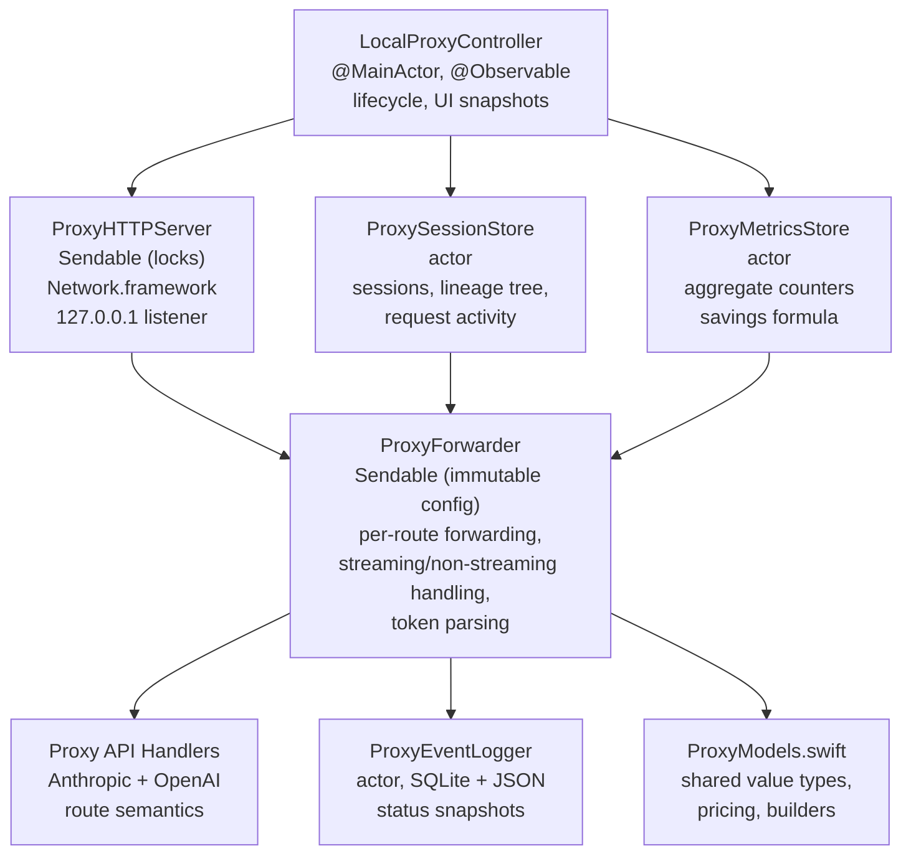
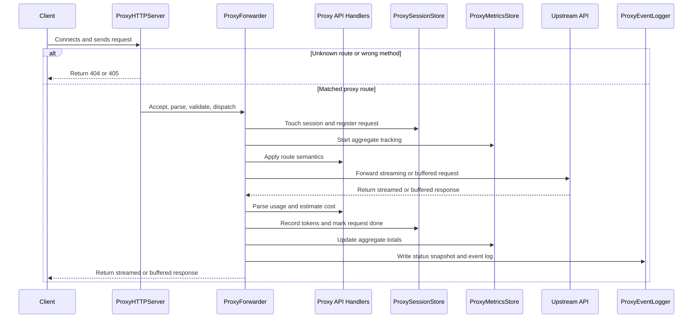

The proxy is an optional local HTTP proxy that sits between AI tools and upstream APIs. It currently serves two route families on the same local port:

- `POST /v1/messages` for Anthropic Messages traffic
- `POST /v1/responses` for OpenAI Responses traffic

Both handlers also accept query-string variants of those paths, such as `/v1/messages?foo=bar` and `/v1/responses?foo=bar`.

It forwards requests transparently while adding two capabilities:

- request observability with per-request token tracking and cost estimation
- a universal lineage tree over proxied requests, used for popup UI display and payload deduplication in the event log

# Why it exists

The proxy provides visibility that upstream APIs do not surface directly in local tools: per-request token usage, per-session aggregation, model selection, byte counts, request timing, and estimated cost. It also assembles proxied requests into a **lineage tree** — a conversation-level structure that lets the popup show only the current leaf of each conversation and lets the event logger store message content once per conversation instead of once per request.

Keep-alive (cache-warming replay requests) is **not currently implemented**; the previous Claude-Code-specific manual keep-alive button and its supporting state were removed in favor of the universal lineage tree. Keep-alive may return in a future iteration built on top of the tree.

# Architecture



## Isolation model

| Component | Isolation | Rationale |
|-----------|-----------|-----------|
| `LocalProxyController` | `@MainActor` | Owns `@Observable` state for SwiftUI binding. Reads snapshots and publishes UI state; does not sit on the request hot path. |
| `ProxySessionStore` | `actor` | Owns mutable per-session state: in-flight counts, the in-memory `LineageTree`, token accumulation, and done requests. |
| `ProxyMetricsStore` | `actor` | Tracks aggregate counters without contending with the richer session store. |
| `ProxyEventLogger` | `actor` | Owns all SQLite and snapshot file I/O so persistence never blocks forwarding. |
| `ProxyHTTPServer` | `Sendable` (lock-based) | Uses `NSLock`-protected containers for active connections and cancellable tasks. Network.framework callbacks require synchronous state access. |
| `ProxyForwarder` | `Sendable` (immutable) | Holds immutable route config plus `URLSession` instances. All mutable state is passed in as actor references. |
| `AnthropicProxyAPIHandler` / `OpenAIResponsesProxyAPIHandler` | `Sendable` value types | Own route-specific request parsing, session identity, lineage fingerprint / message normalization / response-ID extraction, token parsing, and proxy error body shape. |

# Lineage tree

Every request whose body carries a messages-style stack (Anthropic Messages `messages`, OpenAI Responses `input`) — or an OpenAI `previous_response_id` pointer to a previously-seen response — is attached to an in-memory `LineageTree` the moment upstream returns `2xx`.

## Invariants

- A conversation is keyed by `(flavor, fingerprint_hash)`, where the fingerprint is a stable hash of the cache-identity fields: `model`, `system`/`instructions`, `tools`, `tool_choice`, `thinking`/`reasoning`.
- A request enters the tree with `done == false`. `done == false` nodes are always leaves; only `done == true` nodes can acquire children.
- The tree only grows. Existing nodes are never re-parented. If a new request is a strict prefix of an existing node, it becomes a sibling of that node under their common ancestor, not an intermediate ancestor.
- Closest ancestor = the deepest `done == true` node whose messages form a proper prefix of the incoming request's messages.
- Segments hold a non-branching run of normalized messages. A 50-turn conversation lives as a single segment that grows in place. A retry or edited reply creates a new child segment whose parent is the existing segment at the branch point.
- Errored or cancelled mid-stream requests stay `done == false` forever and eventually prune.

## Pruning

- Inactive leaves prune after **24 hours** since their most recent activity (`doneAt` or `createdAt`).
- Pruning cascades upward through now-empty segments and then empty conversations; it stops at any ancestor that still has live children.
- Pruning is destructive in both memory and SQLite. A descendant that later reappears after its ancestor was pruned becomes a new root.

## Session retention and UI visibility

Sessions are a thin UI grouping layer; they do not drive lineage matching.

- Sessions with a recognized flavor (Anthropic / OpenAI) keep their session summary for up to 24 hours; `other` traffic expires after 60 seconds of inactivity when no requests are in flight.
- Active (in-flight) requests are always shown.
- Done requests in flavored sessions are derived from the lineage tree's **done leaves** — a done request stops showing the moment a descendant attaches to it. In untracked (`other`) sessions, done requests follow the 60-second cutoff.
- Errored and cancelled requests disappear from the "active" section on termination and do not become tree leaves.

## Message normalization

Normalization intentionally ignores differences that should not break same-lineage matching, including:

- Claude Code billing-header noise in `system`
- presence or absence of `cache_control`
- string-vs-array text block encoding for message content

Each normalized message is hashed (SHA-256 over canonical JSON) to drive prefix comparison efficiently.

# Request flow

## High-level flow



```
1. Client connects to 127.0.0.1:<port>
2. ProxyHTTPServer accepts NWConnection on its server queue
3. Server reads incrementally until \r\n\r\n header boundary is found
4. Request line and headers are parsed
5. Content-Length is validated; body is accumulated if present
6. Route validation accepts only:
   - `POST /v1/messages` and query-string variants of that path
   - `POST /v1/responses` and query-string variants of that path
   Known route + wrong method => 405
   Unknown route => 404
7. NWResponseWriter is created and the request is dispatched
8. ProxyForwarder.forward() runs for the matched route
9. Session is touched, request state is registered, metrics/logging begin
10. Upstream request is forwarded via streaming or buffered path
11. Token usage and estimated cost are recorded
12. On upstream 2xx, the request is attached to the lineage tree (conversation + segment + tail index) and the node becomes a leaf until the response completes
13. On successful completion, the node is marked `done == true` and the tree's mirror rows are written to SQLite alongside the request row
```

## Session identity

Session identity is a **UI grouping key**, not a lineage key. A conversation in the lineage tree can span multiple session IDs (e.g. Codex subagents) and vice versa; the tree treats them as one conversation whenever their fingerprints and messages align.

- **Anthropic Messages**: session ID comes from `X-Claude-Code-Session-Id`, normalized and stored as `anthropic:<id>`.
- **OpenAI Responses**: treated as Codex session traffic when `session_id` is present and matches the `x-codex-window-id` prefix (`<session_id>:<window_generation>`). Otherwise it falls into `other`. Thread reconciliation across parent/child Codex threads is no longer required — the lineage tree collapses child-thread traffic into the right conversation via `previous_response_id` linkage.
- **Everything else**: falls back to `other`.

Tracked sessions store normal request activity and token/cost aggregation.

### Empirical basis for Codex detection

The OpenAI Responses detection rule above is based on local observations from 2026-04-14 rather than formal OpenAI API documentation.

- Captured Codex traffic in this environment included the session-related headers `x-codex-window-id`, `session_id`, and, for subagents, `x-codex-parent-thread-id`.
- The observed `x-codex-window-id` format was `{conversation_id}:{window_generation}`.
- The observed `x-codex-parent-thread-id` value pointed at the spawning Codex thread, and nested subagents continued that chain recursively.
- Local Codex source confirms that `session_id` is the conversation/thread identifier and that `x-codex-window-id` reuses that identifier with a `window_generation` suffix.
- Local Codex tests indicate `window_generation` starts at `0`, advances after history compaction, persists on resume, and resets on fork.

These observations are strong enough for conservative session identification. The lineage tree links child-thread traffic via `previous_response_id` when available.

## Streaming path

When the request body has `"stream": true`:

1. A per-request `StreamingDelegate` and ephemeral `URLSession` are created.
2. Upload progress updates `ProxyRequestActivity.bytesSent`.
3. When upload finishes, the request transitions to `.waiting`.
4. Response headers arrive through `AsyncStream<Result<HTTPURLResponse, Error>>`.
5. Headers are forwarded to the client with `Transfer-Encoding: chunked`.
6. The request transitions to `.receiving`.
7. Each upstream chunk:
   - updates byte counters
   - is forwarded to the client immediately
   - is accumulated up to 4 MB for terminal token parsing and optional logging
8. The terminal chunk `0\r\n\r\n` is sent after upstream completion.

## Non-streaming path

When `"stream"` is `false` or absent:

1. The shared `nonStreamingSession` is used for connection reuse.
2. A `TaskContext` is registered under `taskIdentifier`.
3. Headers and body are accumulated through the pooled delegate.
4. The full response is returned to the client with `Content-Length`.

# Token usage tracking

Token parsing is route-specific and owned by the matched `ProxyAPIHandler`.

## Anthropic Messages

- **Non-streaming JSON**: parse the top-level `usage` object.
- **Streaming SSE**: parse the final accumulated SSE payload after completion:
  - `message_start.message.usage` contributes input/cache tokens
  - `message_delta.usage` contributes output tokens

## OpenAI Responses

- **Non-streaming JSON**: parse `usage.input_tokens`, `usage.output_tokens`, and `usage.input_tokens_details.cached_tokens`.
- **Streaming SSE**: scan the final accumulated SSE payload for `response.completed` / `response.incomplete` and parse `response.usage`.

## Accumulation

Token usage is recorded at three levels:

1. **Per-request**: `ProxyRequestActivity.tokenUsage` and `.estimatedCost`
2. **Per-session**: `ProxySessionStore.Session` aggregates input/output/cache token totals and estimated cost
3. **Global**: `ProxyMetricsStore` tracks aggregate totals across all sessions

A cumulative cost counter in `ProxySessionStore` survives session expiration until explicitly reset.

# Keep-alive

Keep-alive (cache-warming replay requests) is **not currently implemented**. The universal lineage tree replaces the previous Claude-Code-specific manual keep-alive surface. A future iteration may use the tree's accepted-request nodes to synthesize replay requests across supported providers.

# Error handling

## Parser / validator failures

Handled directly by `ProxyHTTPServer`:

- malformed request line => `400`
- invalid header encoding => `400`
- headers too large (> 64 KB) => `400`
- duplicate or invalid `Content-Length` => `400`
- incomplete body => `400`
- known supported path with non-`POST` method => `405`
- unknown route => `404`

These early failures use the server-level proxy error body builder, which currently defaults to Anthropic-style JSON.

## Forwarder failures

Handled inside `ProxyForwarder`:

- invalid upstream URL => `502`
- upstream connection / timeout / no-response / non-HTTP response => `502`
- client disconnect during streaming => upstream task cancelled and logged
- upstream 4xx / 5xx => forwarded to the client as-is

Once a route is known, proxy-generated forwarder errors use that route's handler-specific error body shape:

- Anthropic route => Anthropic-style error JSON
- OpenAI route => OpenAI-style error JSON

# Event logging

## Database

Events are persisted to `~/.tokenpulse/proxy_events.sqlite` using SQLite with WAL mode. Additional pragmas include:

- `foreign_keys = ON`
- `synchronous = NORMAL`

The database is opened lazily on first write when `ProxyEventLogger` is enabled (i.e. `saveProxyEventLog == true`). A `proxy_schema` table stores the current schema version; on mismatch the whole database is dropped and rebuilt (24h retention means no meaningful loss). The actor provides serialization, so `SQLITE_OPEN_NOMUTEX` is used.

## Tables

### `proxy_conversations`

One row per conversation (cache-identity bucket).

| Column | Type | Description |
|--------|------|-------------|
| `id` | TEXT PK | Conversation UUID |
| `flavor` | TEXT NOT NULL | `anthropicMessages` \| `openAIResponses` |
| `fingerprint_hash` | TEXT NOT NULL | SHA-256 of normalized identity (model + system + tools + tool_choice + thinking) |
| `first_seen` / `last_seen` | TEXT | ISO 8601 timestamps |

### `proxy_lineage_segments`

Non-branching runs of normalized messages. Grows in place when a descendant extends the current tail; branches create a new child segment.

| Column | Type | Description |
|--------|------|-------------|
| `id` | TEXT PK | Segment UUID |
| `conversation_id` | TEXT NOT NULL | FK → `proxy_conversations(id)` `ON DELETE CASCADE` |
| `parent_segment_id` | TEXT | FK → `proxy_lineage_segments(id)` `ON DELETE CASCADE`; nil for root |
| `parent_split_index` | INTEGER NOT NULL | Index in parent at which this segment branches (-1 for root) |
| `messages_json` | TEXT NOT NULL | JSON array of normalized messages for this segment |
| `last_activity` | TEXT NOT NULL | ISO 8601 timestamp |

### `proxy_requests`

One row per forwarded API request. Rows carry both the request metadata and the lineage-tree coordinates of the node they produced.

| Column | Type | Description |
|--------|------|-------------|
| `id` | INTEGER PK | Auto-increment row ID |
| `session` | TEXT NOT NULL | Client session ID |
| `model` | TEXT | Model name extracted from request body |
| `method` | TEXT NOT NULL | HTTP method |
| `path` | TEXT NOT NULL | Request path |
| `upstream_url` | TEXT NOT NULL | Full upstream URL |
| `streaming` | INTEGER NOT NULL | `1` if streaming, `0` otherwise |
| `started_at` / `completed_at` | TEXT | ISO 8601 timestamps |
| `status_code` | INTEGER | Upstream or proxy HTTP status code |
| `duration_ms` | INTEGER | Wall-clock duration |
| `upstream_request_id` | TEXT | `request-id` / `x-request-id` when available |
| `input_tokens` / `output_tokens` / `cache_read_tokens` / `cache_creation_tokens` | INTEGER | Parsed token counts |
| `error` | TEXT | Proxy-side or upstream error text |
| `errored` | INTEGER | `1` if the request errored |
| `conversation_id` | TEXT | FK → `proxy_conversations(id)` `ON DELETE SET NULL` |
| `segment_id` | TEXT | FK → `proxy_lineage_segments(id)` `ON DELETE SET NULL` |
| `tail_index` | INTEGER | Inclusive index into the segment's messages |
| `response_id` | TEXT | Upstream `msg_*` / `resp_*` identifier when known |
| `previous_response_id` | TEXT | OpenAI `previous_response_id` when used |
| `done` | INTEGER NOT NULL | `1` when the node is `done == true` |

Indexes: `started_at`, `(session, started_at)`, `(model, started_at)`, `(status_code, started_at)`, `upstream_request_id`, `conversation_id`, `segment_id`, `response_id`.

### `proxy_lifecycle`

Stores lifecycle events: `proxy_started`, `proxy_stopped`, `session_expired`.

| Column | Type | Description |
|--------|------|-------------|
| `id` | INTEGER PK | Auto-increment row ID |
| `ts` | TEXT NOT NULL | ISO 8601 timestamp |
| `type` | TEXT NOT NULL | Event type |
| `session` | TEXT | Session ID when applicable |
| `port` | INTEGER | Listening port for `proxy_started` |
| `reason` | TEXT | Free-form reason (reserved) |
| `failure_count` | INTEGER | Reserved |

### `proxy_request_content`

Stores request/response captures. When the request has lineage coordinates, the cache-identity fields (`model`, `system`/`instructions`, `tools`, `tool_choice`, `thinking`/`reasoning`), the messages stack (`messages` for Anthropic, `input` for OpenAI Responses), and `previous_response_id` are stripped from the stored body and replaced with refs back to the conversation and segment:

```json
{
  "body_extras": { "max_tokens": 1024, "stream": true, "temperature": 0.2, "...": "..." },
  "body_refs":   {
    "fingerprint": "<conversation-uuid>",
    "lineage":     { "segment_id": "<segment-uuid>", "tail_index": 42 }
  }
}
```

The fingerprint fields live on `proxy_conversations.fingerprint_json`; the messages array lives on `proxy_lineage_segments.messages_json` and is reconstructed by walking the parent chain. Request bodies without lineage coordinates are stored in full otherwise; streaming response bodies are truncated to 4 MB.

| Column | Type | Description |
|--------|------|-------------|
| `request_id` | INTEGER PK | References `proxy_requests(id)` |
| `upstream_request_id` | TEXT | Upstream request ID for cross-reference |
| `request_extras_json` | TEXT | Serialized request (method, path, headers, body — body may be the `body_extras` / `body_refs` shape above) |
| `response_json` | TEXT | Serialized response (status, headers, body) |

Bodies are serialized as UTF-8 when possible, otherwise base64. Bodies whose fingerprint and messages have been substituted with refs are marked with `"encoding": "utf8-refs"`.

## Retention and pruning

- maximum event age: 24 hours
- prune check interval: at most once every 5 minutes, opportunistically on writes
- SQLite prune targets: `proxy_requests`, `proxy_lifecycle`
- `proxy_request_content` is cascade-deleted with its parent `proxy_requests` row
- `proxy_lineage_segments` and `proxy_conversations` rows are removed via `ProxyEventLogger.pruneLineageMirror(...)` after the in-memory `LineageTree.prune(...)` drops them, so both sides stay in sync
- `PRAGMA wal_checkpoint(PASSIVE)` runs after each prune pass

## Insert strategy

Request logging uses a two-phase approach:

1. `logRequestStarted()` inserts the start row and returns its row ID
2. `logRequestCompleted()` or `logRequestFailed()` updates that row

If the initial insert fails, the logger falls back to a standalone insert with the final data.

# Status snapshots

When `ProxyEventLogger` is enabled (`saveProxyEventLog == true`), the proxy writes an atomic JSON snapshot to `~/.tokenpulse/proxy_status.json` after forwarded proxy request completions and during forced proxy shutdown. The writes are throttled, so multiple completions inside the throttle window may collapse into one later snapshot.

## Format

```json
{
  "enabled": true,
  "port": 8080,
  "activeSessions": 2,
  "totalRequestsForwarded": 47,
  "totalInputTokens": 245000,
  "totalOutputTokens": 18200,
  "totalCacheReadInputTokens": 180000,
  "totalCacheCreationInputTokens": 12000,
  "lastUpdatedAt": "2026-04-13T10:30:00Z"
}
```

The keep-alive fields (`activeKeepalives`, `totalKeepalivesSent`, `totalKeepalivesFailed`) and the per-snapshot cache summary counters (`cacheReads`, `cacheWrites`) were removed along with the keep-alive surface; per-request cache token counts still land on `proxy_requests` and on per-session totals.

## Throttling

Writes are throttled to a minimum 1-second interval. When a new snapshot arrives inside that window:

1. it becomes `pendingStatusSnapshot`
2. a delayed flush task is scheduled
3. only the latest pending snapshot is written when the task fires

Forced writes, used during proxy shutdown, bypass the throttle and cancel any pending flush.

# Configuration

Proxy settings live in `~/.tokenpulse/config.json` and are managed by `ConfigService`.

| Field | Type | Default | Description |
|-------|------|---------|-------------|
| `proxyEnabled` | Bool | `false` | Whether the proxy starts automatically with the app |
| `proxyPort` | Int | `8080` | TCP port to bind on `127.0.0.1` |
| `anthropicUpstreamURL` | String | `"https://zenmux.ai/api/anthropic"` | Base URL for Anthropic Messages forwarding |
| `openAIUpstreamURL` | String | `"https://api.openai.com"` | Base URL for OpenAI Responses forwarding |
| `saveProxyEventLog` | Bool | `true` | Master on/off for `ProxyEventLogger`. When enabled, the logger persists metadata to SQLite and captures deduplicated request/response payloads via the lineage tree. When disabled, no SQLite database is opened and no status snapshot is written. |

The legacy `keepaliveEnabled`, `keepaliveIntervalSeconds`, `proxyInactivityTimeoutSeconds`, and `saveProxyPayloads` fields are still tolerated by the config migration (they were fields in version 6) but are no longer written or read by the live code. The current config schema version is `7`.

Legacy `proxyUpstreamURL` is still read during config migration and mapped to `anthropicUpstreamURL`.

# Constraints

| Constraint | Value | Enforced by |
|------------|-------|-------------|
| Bind address | `127.0.0.1` (IPv4 loopback only) | `ProxyHTTPServer` |
| Supported endpoints | `POST /v1/messages` and `POST /v1/responses`, plus query-string variants of those paths | `LocalProxyController.requestValidator` |
| Max Content-Length | 50 MB (`50_000_000`) | `ProxyHTTPServer.processRequest()` |
| Max header size | 64 KB (`65_536`) | `ProxyHTTPServer.readRequest()` |
| Tracked session retention (Anthropic / OpenAI) | 24 hours since last activity | `LocalProxyController.sessionRetentionSeconds` + `ProxySessionID.usesShortRetentionWindow(...)` |
| `other` session retention | 60 seconds since last activity | `LocalProxyController.otherTrafficRetentionSeconds` |
| Tracked session UI visibility | 10 minutes since last activity, or any in-flight request | `LocalProxyController.visibleSessionActivities(...)` |
| Lineage-tree leaf retention | 24 hours since last activity | `LocalProxyController.lineageTreePruneRetention` + `LineageTree.prune(...)` |
| Untracked / `other` done request retention | 60 seconds | `LocalProxyController.otherTrafficRetentionSeconds` + `ProxySessionStore.pruneStaleDoneRequests(...)` |
| Event retention | 24 hours | `ProxyEventLogger.maxEventAge` |
| Event prune pass | Opportunistic on write after 5 minutes have elapsed since the last prune | `ProxyEventLogger.pruneInterval` |
| Status snapshot throttle | 1 second minimum interval | `ProxyEventLogger.statusSnapshotThrottleInterval` |
| Streaming capture for parsing/logging | 4 MB max | `ProxyForwarder.maxLoggedStreamingResponseBytes` |
| Forwarding timeouts | 300s request / 600s resource | `ProxyForwarder` URLSession configuration |

# Key files

| File | Role |
|------|------|
| `Proxy/LocalProxyController.swift` | `@MainActor` lifecycle owner; starts/stops server; publishes UI state; drives refresh + lineage-tree pruning |
| `Proxy/ProxyHTTPServer.swift` | Network.framework HTTP/1.1 listener; parser; validator; `NWResponseWriter` implementation |
| `Proxy/ProxyForwarder.swift` | Route-specific forwarding, streaming/non-streaming handling, token parsing, tree attach/markDone wiring |
| `Proxy/AnthropicProxyAPIHandler.swift` | Anthropic Messages route semantics, session identity, fingerprint/messages normalization, Anthropic error bodies |
| `Proxy/OpenAIResponsesProxyAPIHandler.swift` | OpenAI Responses route semantics, strict Codex session detection, `previous_response_id` extraction, token parsing, OpenAI error bodies |
| `Proxy/LineageTree.swift` | In-memory lineage tree: conversations, segments, nodes, attach/markDone/leaf queries/prune/reconstruction |
| `Proxy/ProxySessionStore.swift` | Actor; session lifecycle, request state machine, token accumulation, lineage-tree ownership and mirror context construction |
| `Proxy/ProxyEventLogger.swift` | Actor; SQLite event persistence, lineage mirror tables, deduplicated payload storage, status snapshots with throttling |
| `Proxy/ProxyMetricsStore.swift` | Actor; aggregate counters and savings formula |
| `Proxy/ProxyModels.swift` | Shared value types and helpers: `ProxyAPIFlavor`, `ProxySessionID`, `LineageFingerprint`, `TokenUsage`, `ModelPricingTable`, `ProxyHTTPUtils` |
